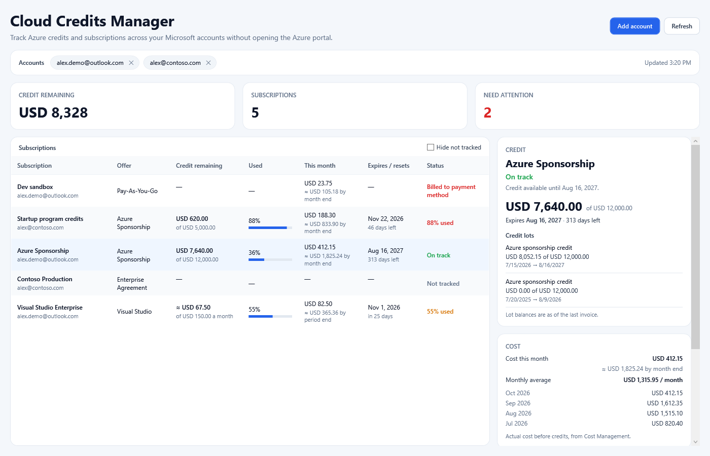

# Cloud Credits Manager

[](https://github.com/ppiova/AzureCreditsApp/actions/workflows/ci.yml)
[](https://github.com/ppiova/AzureCreditsApp/actions/workflows/msix-release.yml)
[](LICENSE)

Cloud Credits Manager is a Windows desktop app for tracking Azure credits across Microsoft accounts and subscriptions without opening the Azure portal.

## Preview



The screenshot uses sample data.

## Features

- Sign in with several Microsoft accounts (personal and work/school) and stay signed in between sessions.
- Lists every subscription each account can see, across all its directories.
- Detects the offer from the subscription quota id (Azure Sponsorship, Visual Studio, Pay-As-You-Go, ...) and shows the spending limit. A sponsorship that was converted to Pay-As-You-Go is detected even if it kept its old name.
- **Azure Sponsorship and other Microsoft Customer Agreement credits:** remaining balance, original amount and expiration date of each credit lot.
- **Visual Studio monthly credit:** there is no public API, so you enter the monthly amount once and the app estimates what is left from this billing period's cost.
- Flags what needs attention: credit over 80% used, credit expiring within 30 days, disabled subscriptions, and subscriptions billed to your payment method that still have resources or cost.
- Cost this month per subscription with a projection to the end of the month (or billing period), plus six months of history and the monthly average, from Cost Management.
- *Hide not tracked* filter for subscriptions billed to an organization (Microsoft internal, Enterprise Agreement, CSP); the choice is remembered.

Planned: usage alerts with Windows notifications and a tray icon, Azure budgets, and burn-rate forecasts. See the [milestones](../../milestones).

## Where credit data comes from

| Offer | Source |
| --- | --- |
| Azure Sponsorship on a Microsoft Customer Agreement billing profile | `Microsoft.Consumption/credits/balanceSummary` and `lots` on the billing profile (exact). |
| Visual Studio / partner network monthly credit | Monthly amount you enter, minus the actual cost of the current billing period (estimate). |
| Pay-As-You-Go | No credit; the app counts resources and cost to warn you. |

Credit on a billing profile is shared by every subscription billed to it, so the total is counted once.

## Privacy

The app only reads from Azure, and sends nothing to the developer or any third party. See the [privacy policy](docs/privacy-policy.md).

Sign-in uses the Microsoft identity platform in your browser; tokens are kept in the Windows-protected MSAL token cache. The app stores, under `%AppData%\AzureCreditsApp`:

- `accounts\` — which accounts are signed in (no tokens),
- `monthly-credits.json` — the monthly amounts you entered,
- `settings.json` — display preferences such as the *Hide not tracked* filter,
- `cache\costs\` — the last cost results, reused for up to three hours because Cost Management throttles requests.

## Requirements

- Windows 10 version 1809 or later.
- Read access to the subscriptions and billing profiles you want to track.

## Development

Building from source requires the .NET 10 SDK.

Run locally:

```powershell
dotnet run --project .\AzureCreditsApp\AzureCreditsApp.csproj
```

Build and test:

```powershell
dotnet build .\AzureCreditsApp\AzureCreditsApp.csproj
dotnet test .\AzureCreditsApp.Tests\AzureCreditsApp.Tests.csproj
```

### Solution layout

| Project | Purpose |
| --- | --- |
| `AzureCreditsApp` | WPF app (.NET 10): `Services/` (sign-in, Azure REST calls, credit calculation), `Models/`, `ViewModels/`, shared styles in `Themes/`, icon in `Assets/`. |
| `AzureCreditsApp.Package` | Windows Application Packaging Project that builds the MSIX for sideloading and the Microsoft Store. |
| `AzureCreditsApp.Tests` | xUnit tests. |

The packaging project needs the Visual Studio MSIX tooling (DesktopBridge targets), so it is built with MSBuild in GitHub Actions rather than with `dotnet build`.

## MSIX releases

GitHub Actions builds the MSIX package: every pull request checks that packaging still works, a version tag publishes a signed package to [GitHub Releases](../../releases), and a manual workflow builds the package for the Microsoft Store.

```powershell
git tag v1.0.0
git push origin v1.0.0
```

See [PACKAGING.md](PACKAGING.md) for installing a release, the signing certificate, and the Microsoft Store submission steps.

If Windows shows certificate error `0x800B010A`, download the release ZIP and run `Install-CloudCreditsManager.ps1`, or import the included `.cer` before opening the `.msix`.

## License

This project is licensed under the [MIT License](LICENSE).
